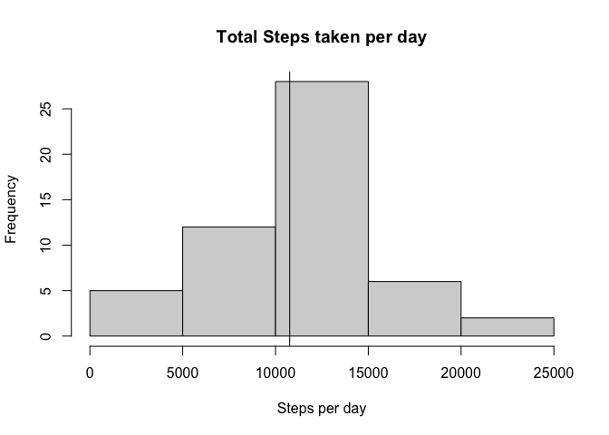
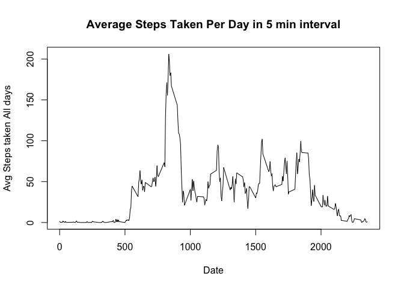
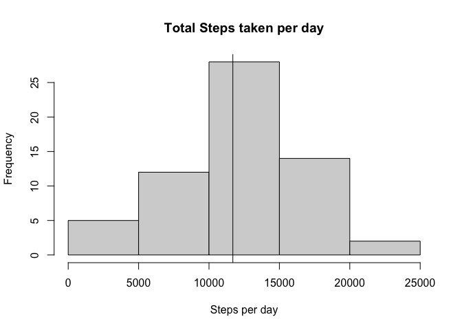
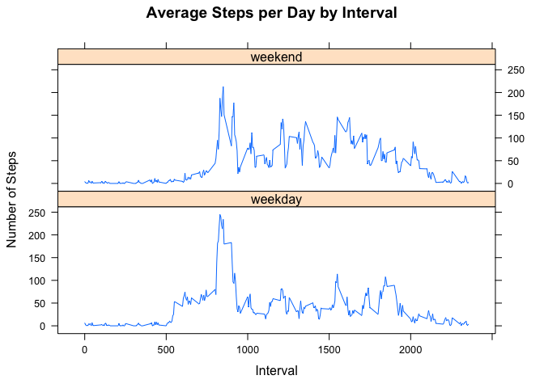

This document shows the analysis of activity data. There is a 5min interval wise data for steps taken, collected over few days. We are going to parse the data and perform some analysis to see what we can infer from it. There is some data which is missing but we can fill those in by imputing in due course of analysis. 

### Loading and preprocessing the data
First we are unzipping the csv file in the current working directory. We can read the data into data frame and then set the date column as Date instead of String type.

```r
unzip("activity.zip",exdir= ".")
activity_data <-read.csv("activity.csv")
activity_data$date <- as.Date(activity_data$date)
```


### Summarizing the data
We can group the number of steps by date and sum the number of steps to get total number of steps taken per day. Some of the data is missing (NA), so we removed those data during analysis. This can be seen in the below histogram -


```r
library(dplyr)
per_day_data<- activity_data[!is.na(activity_data$steps),] %>% group_by(date) %>% summarize(totalSteps = sum(steps, na.rm = TRUE))
hist(per_day_data$totalSteps , xlab = "Steps per day" , main="Total Steps taken per day")
abline(v= mean(per_day_data$totalSteps))
```

<!-- -->

The summary of the data can be seen below.


```r
my_summary <- summary(per_day_data$totalSteps)
my_summary
```

```
##    Min. 1st Qu.  Median    Mean 3rd Qu.    Max. 
##      41    8841   10765   10766   13294   21194
```

We found that the total mean steps taken per day is 1.0766189\times 10^{4} and the median of the data lies at 1.0765\times 10^{4}.

### Average daily activity pattern
We plotted a 5 min interval time series data for the average number of steps taken per day. We grouped the data by interval and took mean of steps of all days. But we removed the missing data.

```r
interval_data <- activity_data[!is.na(activity_data$steps),] %>% group_by(interval) %>% summarize(steps = mean(steps, na.rm = TRUE))
plot(interval_data ,type = "l", xlab = "Date" , ylab = "Avg Steps taken All days" , main = "Average Steps Taken Per Day in 5 min interval"  )
```

<!-- -->

The maximum number of steps can be seen at interval 835 which can also be seen at above graph.

### Imputing missing values
The total number of rows having missing data is 2304. So we have to impute this data with following strategy -  
    -- Iterate through the missing values  
    - Set the steps with the median of random 5 sample of same interval.  
    - To reproduce the research we should set a seed before sampling  

```r
activity_data_2 <- activity_data
for(i in 1:nrow(activity_data_2)){
    if(is.na(activity_data_2[i,1])){
        set.seed(100)
        observant_data <- activity_data_2[(activity_data_2$interval == activity_data_2[i,3] & 
                                                               !is.na(activity_data_2$steps) &
                                                                activity_data_2$steps != 0 ),1]
        activity_data_2[i,1]<- median(sample(observant_data,ifelse(length(observant_data) >=5 , 5 ,length(observant_data))), na.rm = TRUE)
    }
}
```

After imputation, the histogram looks like this -

```r
per_day_data<- activity_data_2 %>% group_by(date) %>% summarize(totalSteps = sum(steps, na.rm = TRUE))
hist(per_day_data$totalSteps , xlab = "Steps per day" , main="Total Steps taken per day")
abline(v= mean(per_day_data$totalSteps))
```

<!-- -->

And the mean and median has changed and can be seen here -  

```r
my_summary <- summary(per_day_data$totalSteps)
my_summary
```

```
##    Min. 1st Qu.  Median    Mean 3rd Qu.    Max. 
##      41    9819   11458   11694   15084   21194
```

We found that the new total mean steps taken per day is 1.1693738\times 10^{4} and the new median of the data lies at 1.1458\times 10^{4}.


### Differences in activity patterns between weekdays and weekends
We can group the data based on weekday or weekend and then can see the total number of steps taken per day for these two groups.


```r
weekdays <- c("Monday", "Tuesday","Wednesday","Thursday","Friday")
activity_data_2 <- mutate(activity_data_2 , day_type = ifelse( weekdays(activity_data_2$date) %in% weekdays , "weekday","weekend" ) )
interval_data <- activity_data_2 %>% group_by(interval, day_type) %>% summarize(steps = mean(steps, na.rm = TRUE))
library(lattice)
xyplot(interval_data$steps ~ interval_data$interval | interval_data$day_type, main="Average Steps per Day by Interval", xlab="Interval", ylab="Number of Steps", layout=c(1,2), type="l")
```

<!-- -->

### Conclusion
From the above analysis we can tell that the people are more active on weekdays then weekends. But usually they are more active around during a certain interval throught out the day.

